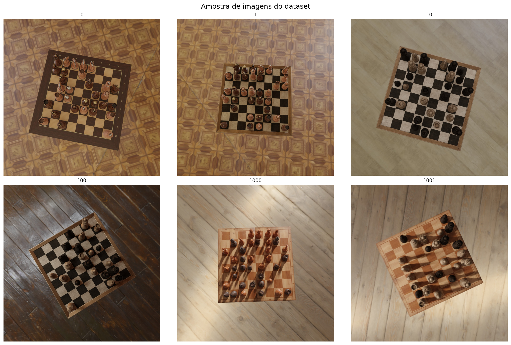
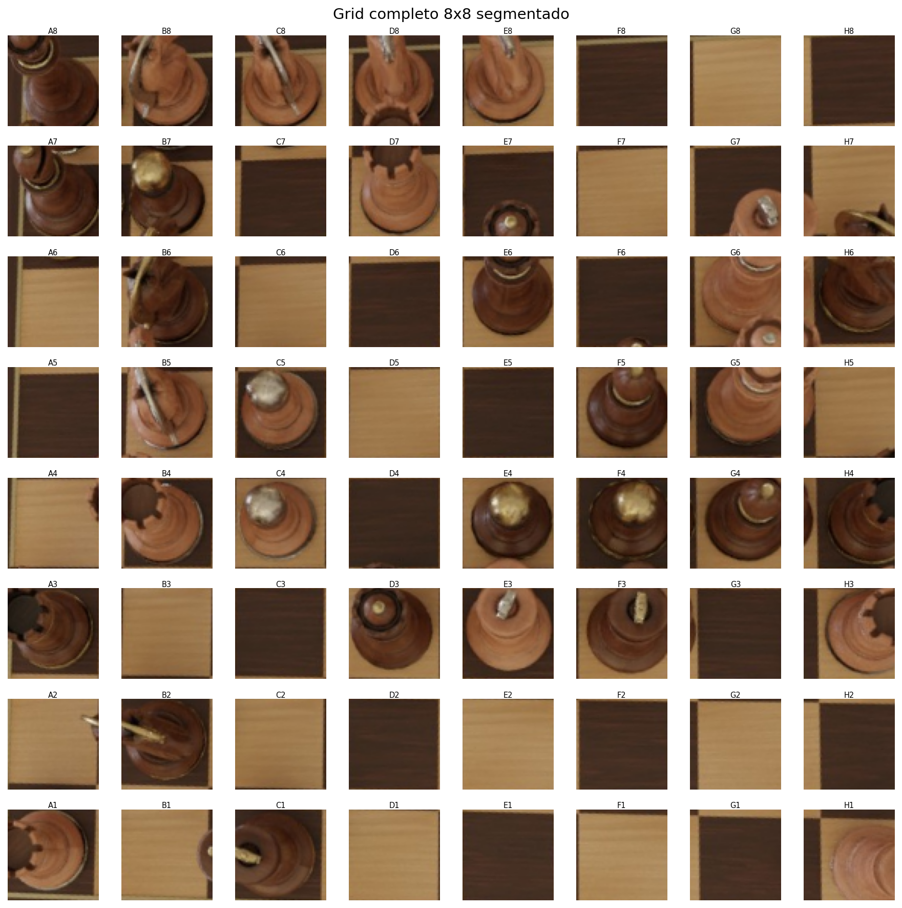
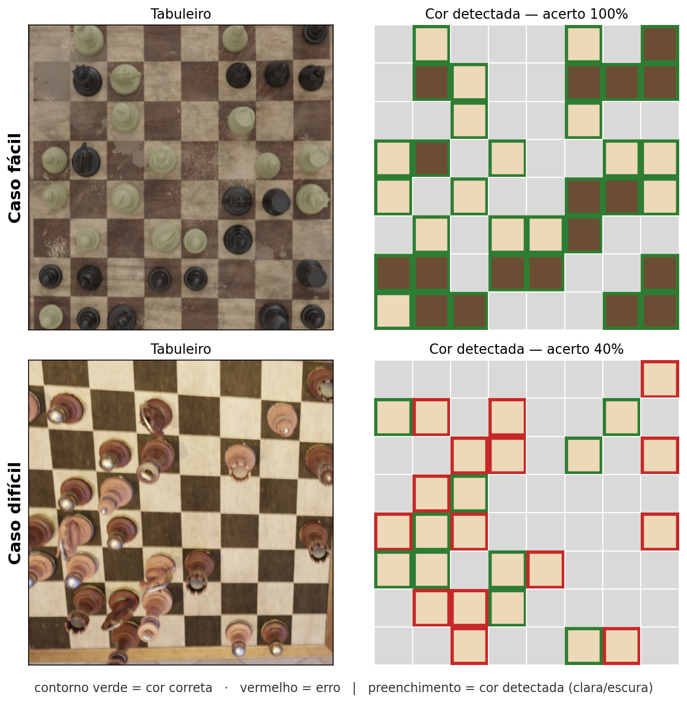
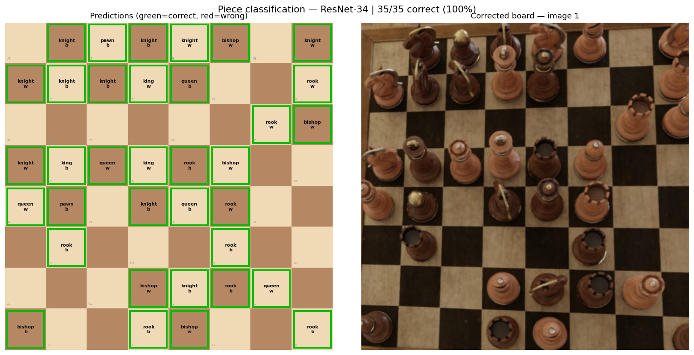

# Análise de Tabuleiros de Xadrez

## Andamento do projeto — Classificação de Peças com Deep Learning

**Davi Ludvig e Julia Macedo**
**Disciplina:** INE410121 / TRV410001 — Visão Computacional - UFSC
**Dataset:** Synthetic Chess Board Images — Kaggle (thefamousrat)

---

## O Problema

**Dada uma foto de um tabuleiro de xadrez em perspectiva, reconstruir o estado completo do jogo:** ocupação, cor e **tipo** de cada peça.

Imagens (Kaggle) — peças e tabuleiro de **madeira**, material uniforme que cria baixo contraste e dificulta a separação peça × fundo.

---

## O Dataset

- ~1 900 renders 1280×1280 de tabuleiros em ângulo
- Superfícies, iluminação e ângulos variados
- Anotações por imagem: **posição das peças** + **cantos do tabuleiro** (ground truth [GT] = gabarito)

O desafio: a câmera em perspectiva deforma as casas e as silhuetas das peças.

---

## Recapitulando: o Pipeline Clássico

Da foto original ao mapa de ocupação 8×8 — **só técnicas clássicas de CV**:

Detecção de bordas (Canny) → linhas do grid (Hough) → homografia (vista de cima) → segmentação em 64 casas → votação de características para **ocupação** e threshold HSV para **cor**.

---

## Leitura do Tabuleiro — Linhas de Hough

A partir das bordas (Canny), a **Transformada de Hough** encontra as retas da imagem. Filtramos e classificamos em **horizontais** (verde) e **verticais** (azul) para reconstruir o grid do tabuleiro.

---

## Correção de Perspectiva (Homografia)

Com os 4 cantos do tabuleiro, uma **homografia** transforma a foto em ângulo numa **vista de cima** (480×480) — onde as 64 casas viram um grid regular, fácil de recortar.

---

## Segmentação: 64 Casas Individuais

Dividida a vista de cima em 8×8, cada casa vira um **recorte independente** — a matéria-prima tanto para a **ocupação** quanto para o **classificador de peças**.

---

## Ocupação: Detectado vs Gabarito

Cada casa é marcada como **ocupada** (vermelho) ou **vazia** (verde). Lado a lado com o gabarito, vê-se onde o detector clássico erra — em geral marcando casas vazias como ocupadas (falsos positivos).

---

## Cor da Peça — Clara ou Escura?

**Como decidimos a cor**

Olhamos o **brilho** dos pixels no centro da peça — o canal **V (valor/brilho) do HSV** — e comparamos com um **limiar fixo**:

- brilho **alto** → peça **clara**
- brilho **baixo** → peça **escura**

Acerto geral: **82.5%**

**Fáceis** (38% das imagens, ≥90%) têm bom contraste; **difíceis** (18%, <70%) têm sombra ou peça escura sobre casa escura — o limiar fixo erra.

---

## O que foi feito neste período

A pipeline clássica (apresentação anterior) detectava **ocupação** e **cor** — mas não o tipo de peça. Este andamento cobre a implementação completa do classificador.

| Etapa | Status anterior | **Status atual** |
|---|---|---|
| Leitura do tabuleiro (Hough + homografia) | ✅ Concluído | ✅ Concluído |
| Detecção de ocupação (votação de características) | ✅ Concluído | ✅ Concluído |
| Classificação de cor (HSV) | ✅ Concluído | ✅ Concluído |
| **Identificação de tipo de peça** | ⏳ Pendente | ✅ **Concluído — F1 = 91%** |
| Notação PGN / detecção de jogadas | 📋 Planejado | 📋 Planejado |

**O que é F1?** Média harmônica entre **precisão** (das peças detectadas, quantas existem de fato) e **recall** (das peças que existem, quantas foram detectadas). Só é alto quando ambos são altos.

$$F1 = 2 \cdot \frac{\text{precisão} \cdot \text{recall}}{\text{precisão} + \text{recall}}$$

---

## O Desafio da Classificação de Tipo

As peças no dataset são feitas de **madeira com tons similares** ao tabuleiro, o que dificulta abordagens puramente clássicas:

- Template matching: sensível à escala e rotação
- Confusão entre peças de silhueta parecida (peão × bispo)
- A câmera em ângulo deforma a silhueta das peças

---

## Solução: Transfer Learning com ResNet-34

Para a classificação de tipo trocamos as técnicas clássicas por **Deep Learning** (uma rede neural convolucional), mantendo o pipeline clássico em tudo que vem antes.

A **ResNet-34** é um **modelo** pronto — uma arquitetura de rede neural convolucional com 34 camadas (família ResNet, 2015). *Transfer learning* e *fine-tuning*, abaixo, são as **técnicas** com que a treinamos.

**Por que a ResNet-34?**

- **Pré-treinada no ImageNet** (1,2 milhão de imagens): as primeiras camadas já aprenderam a reconhecer bordas, texturas e formas genéricas, úteis em qualquer imagem. Reaproveitamos esse conhecimento em vez de treinar do zero — funciona bem mesmo com poucos dados próprios.
- **Tamanho moderado** (~21 milhões de parâmetros): grande o bastante para a tarefa, sem ser tão grande a ponto de "decorar" (*overfitting*) as nossas ~62 000 células.

**Treinamento em duas fases:**

1. **Transfer Learning** — congelamos o corpo da rede e treinamos apenas a nova cabeça classificadora (as 12 classes de peça). É seguro: não estraga as características herdadas do ImageNet.
2. **Fine-tuning** — descongelamos a rede inteira e reajustamos com taxa de aprendizado pequena (menor nas camadas iniciais, maior nas finais), adaptando as características ao nosso domínio sem apagá-las.

---

## Construção do Dataset de Treinamento

Para treinar, precisamos de **imagens rotuladas de células individuais**:

1. Para cada imagem do dataset, busca-se no gabarito as coordenadas para endireitar o tabuleiro
2. Detecta-se a orientação automaticamente (densidade de bordas)
3. Cada célula ocupada é salva em `outputs/piece_cells/{label}/` como uma imagem recortada, já rotulada pelo tipo da peça

**Volume:** ~1 944 imagens × ~32 peças ≈ **62 000 células**

| Peça | Qtd aprox. (cada cor) |
|---|---|
| Peão | ~5 200 |
| Torre | ~5 100 |
| Cavalo | ~5 200 |
| Bispo | ~5 100 |
| Dama | ~5 200 |
| Rei | ~5 200 |

Como as peças são posicionadas **aleatoriamente** (dataset sintético), cada tipo aparece com frequência parecida — classes **balanceadas**, ao contrário de uma partida real.

---

## Treinamento

**As duas fases na prática**

- **Fase 1 — Transfer Learning (10 épocas):** com o corpo da rede congelado, treinamos só a camada final. É rápido e ajusta a nova cabeça sem risco de estragar o que veio do ImageNet.
- **Fase 2 — Fine-tuning (15 épocas):** descongelamos a rede inteira e refinamos com taxa de aprendizado bem menor — e ainda menor nas camadas iniciais — para adaptar sem apagar.

Uma *época* é uma passada completa por todas as ~62 000 células.

**Aumento de dados (*data augmentation*)**

Para a rede não "decorar" e funcionar com o tabuleiro em qualquer posição, geramos variações aleatórias de cada célula a cada época:

- espelhamento horizontal e vertical
- rotação de até 15°
- variação de brilho, contraste e saturação

As imagens entram em 224×224 e normalizadas, no padrão que a ResNet espera. Treinado em **GPU (CUDA)**, em lotes de **64 imagens**.

---

## Resultados — Ocupação (pipeline clássica)

**10 imagens · cantos detectados automaticamente (Hough)**

| Métrica | Valor |
|---|---|
| Recall médio | **81.6%** |
| Precisão média | 62.5% |
| F1 médio | 69.8% |
| Acurácia média | 65.5% |

Faixa por imagem: **50.0%** (pior) → **98.4%** (melhor)

**O que os números dizem**

A pipeline **acha quase todas** as peças (recall alto), mas **erra para mais** — marca casas vazias como ocupadas (precisão menor).

O gargalo não é a ocupação em si, e sim **achar os 4 cantos do tabuleiro**:

Com cantos corretos (GT):
F1 **70% → 88%**

O que resta é um limite **intrínseco**: peças e tabuleiro são da mesma **madeira** → baixo contraste.

---

## Resultados — Tipo de peça (classificador DL)

Avaliado com a **ocupação do gabarito (GT)** — assim medimos só o classificador, sem herdar os erros do pipeline clássico.

F1 = **91%**  (precisão = recall)
1 412 peças certas · 140 erradas · 50 imagens

**Acurácia por tipo de peça**

| Peça | Preta | Branca |
|---|---|---|
| Cavalo | **96.4%** | **95.9%** |
| Peão | 96.3% | 93.8% |
| Torre | 89.2% | 90.1% |
| Dama | 87.8% | 90.8% |
| Bispo | 88.2% | 87.6% |
| Rei | **84.5%** ← pior | 89.7% |

Melhor: **cavalo** (silhueta única). Pior: **rei preto** — rei e dama são altos e parecidos, e o tom escuro esconde os detalhes.

*Imagem 1 — 35/35 peças corretas (100%)*

---

## Pipeline Completa: do Pixel à Jogada

Imagem original · 1280×1280

▼ &nbsp;Hough + homografia

Tabuleiro retificado · 480×480

▼ &nbsp;votação de características

Mapa de ocupação 8×8

▼ &nbsp;ResNet-34

Mapa de peças · {A1: torre preta, …}

▼ &nbsp;comparação entre frames

Detecção de jogadas

Clássico faz a leitura geométrica do tabuleiro.
Deep Learning entra **só** no tipo de peça.

| Etapa | Resultado |
|---|---|
| Ocupação | F1 70% · **88%** c/ cantos GT |
| **Tipo da peça** | **F1 91%** |
| Cor (HSV) | ~82% |

A parte de Deep Learning é hoje a **mais precisa** do pipeline. O gargalo de ponta a ponta continua sendo a etapa clássica de **detectar os cantos** do tabuleiro.

---

## Próximos Passos

**1 · Notação de jogadas**
- Converter `piece_map → FEN` (direto)
- Coletar frames de uma partida contínua para detectar lances reais
- Validar a legalidade dos lances

**2 · Reforçar a pipeline clássica**
- Reduzir falsos positivos na ocupação
- Resolver a ambiguidade de orientação 180° sem gabarito

**3 · Distribuir o modelo**
- Publicar os pesos `.pth` (GitHub Releases / HuggingFace)
- `setup.py` baixando o modelo automaticamente

**4 · Generalização (*domain shift*)**
- Testar num jogo real
- Iluminação variável e peças de outros materiais

O gargalo conhecido (detecção de cantos) e o salto jogadas random -> jogo real são as prioridades para um pipeline robusto fora do dataset.

---

## Conclusão

| Componente | Abordagem | Resultado |
|---|---|---|
| Detecção do tabuleiro | Hough + homografia | Robusto, mas precisa de melhoria |
| Segmentação 8×8 | Divisão uniforme | Exato |
| Ocupação | Votação de características (clássico) | F1 = 70% · 88% c/ cantos GT |
| Cor da peça | Limiar fixo de brilho HSV (clássico) | ~82% |
| **Tipo da peça** | **ResNet-34 — transfer learning + fine-tuning** | **F1 = 91%** |

Combinamos **visão clássica** (geometria do tabuleiro) com **transfer learning** (tipo de peça) num pipeline completo de leitura — usando cada abordagem onde ela é mais forte. O classificador de tipo, a entrega deste período, é hoje a etapa mais precisa.

