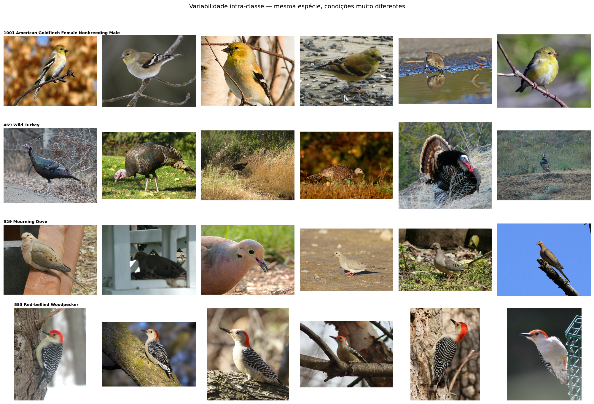
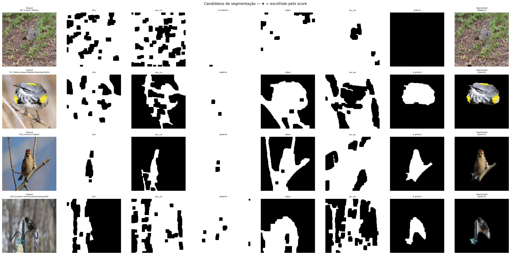
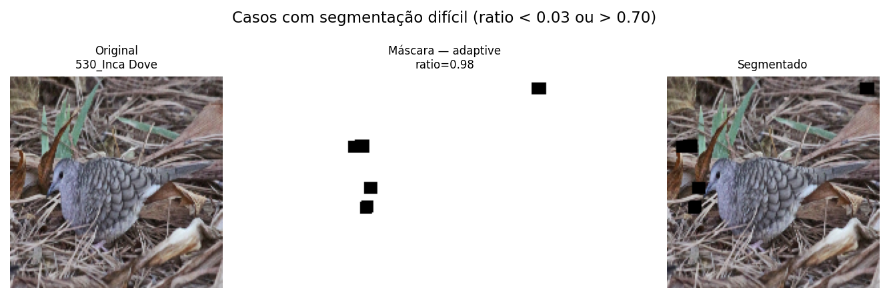

# Identificação de Espécies de Pássaros

## com Visão Computacional Clássica

**Disciplina:** INE410121 / TRV410001 — Visão Computacional · UFSC
**Dataset:** Backyard Feeder Birds (NABirds Subset) — Kaggle

---

## O Problema

**Dado uma foto de pássaro, qual é a espécie?**

Classificação automática de espécies é um problema real com aplicações em monitoramento ambiental, estudos de biodiversidade e cidadão-ciência.

Queremos resolver isso usando transformações clássicas de imagem encadeadas em uma pipeline.

O dataset tem **25 espécies** fotografadas em condições reais: jardins, comedouros, árvores.

---

## Por Que é Difícil?

**Variabilidade visual altíssima:**

- A mesma espécie aparece em poses, escalas e iluminações muito diferentes
- Espécies distintas podem ser visualmente parecidas (ex: Sparrows)
- Fundo sempre diferente: galhos, comedouros, céu, sombra

O maior desafio clássico é **isolar o pássaro do fundo** sem supervisão explícita de onde ele está na imagem.

---

## Nossa Abordagem

Construímos uma **pipeline de quatro etapas**, seguindo a lógica de processamento progressivo da disciplina:

1. **Pré-processamento** — padronizar escala e representação de cor
2. **Segmentação** — isolar a região do pássaro do fundo
3. **Extração de características** — descrever cor, textura, forma e bordas da região isolada
4. **Classificação** — prever a espécie a partir desses descritores

---

## Estado Atual e Dúvidas

**O que já funciona:**

- Pipeline end-to-end rodando
- Segmentação com múltiplos candidatos e seleção automática
- Classificação supervisionada funcionando

**O que queremos discutir:**

- A segmentação é o gargalo principal — como melhorar a separação ave/fundo usando métricas de cor?
- É factível pensarmos na classificação ou é melhor restrigir o escopo para segmentação e extração de características (identificação)?
- O problema está adequado ao escopo da disciplina?

