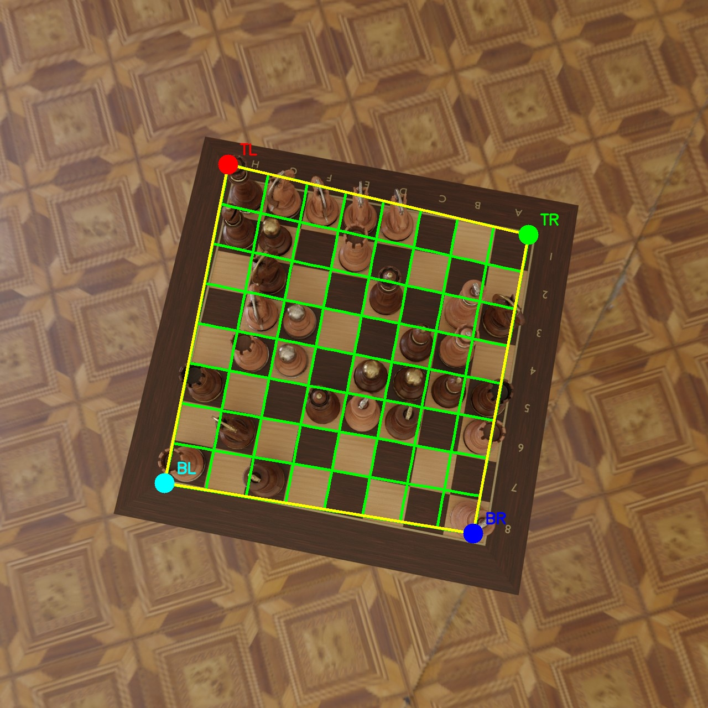
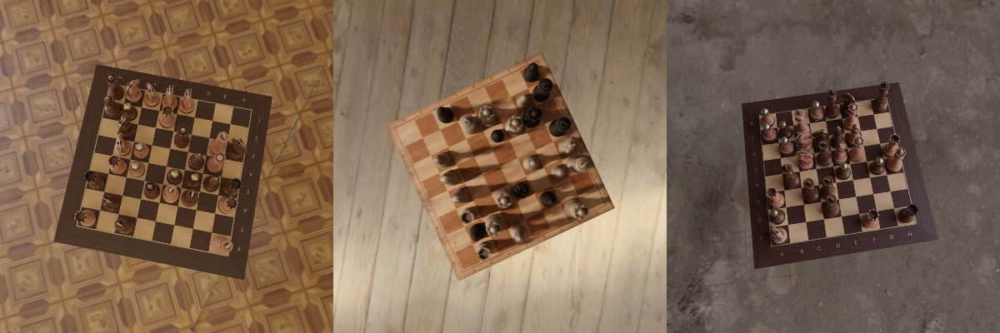
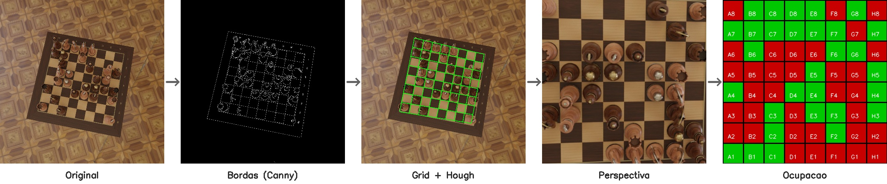
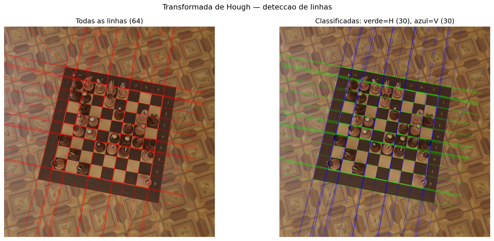
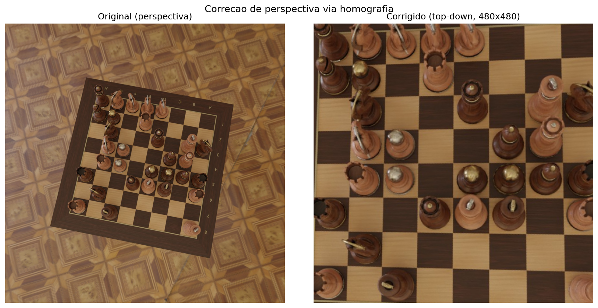
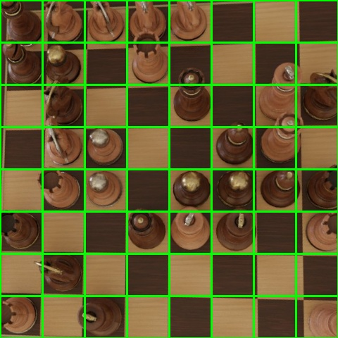
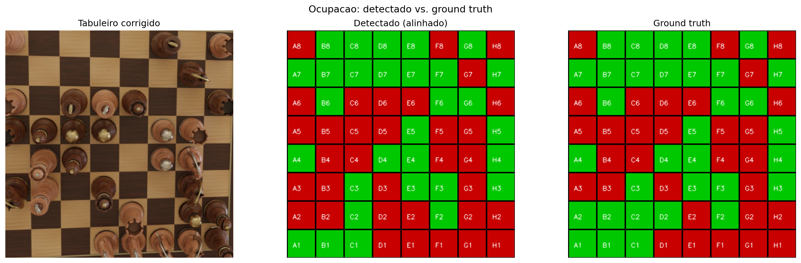
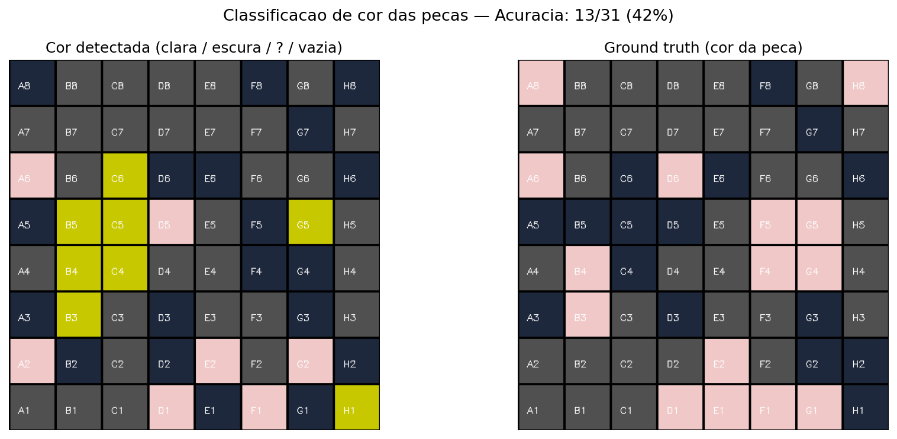
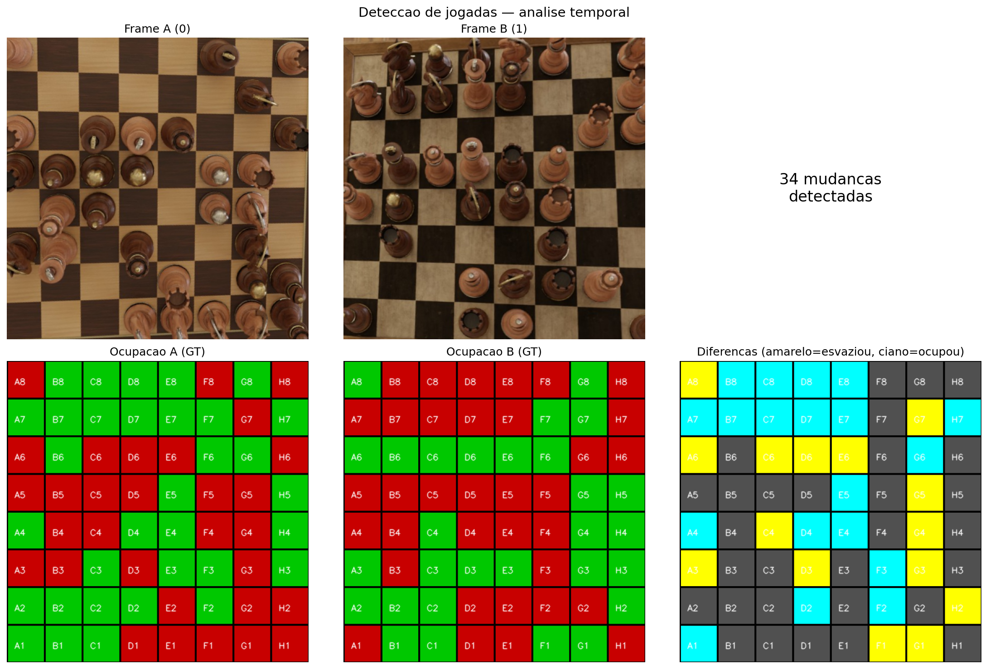

# Analise de Tabuleiros de Xadrez

## Visao computacional classica para leitura de tabuleiros, identificacao, classificacao de pecas e sugestao de jogadas.

**Davi Ludvig e Julia Macedo**
**Disciplina:** INE410121 / TRV410001 — Visao Computacional - UFSC
**Dataset:** Synthetic Chess Board Images — Kaggle (thefamousrat)

---

## O Problema

**Dada uma imagem de um tabuleiro de xadrez em perspectiva, determinar o estado de cada casa.**

Imagens com pecas e tabuleiro de **madeira** — material uniforme que cria baixo contraste, desafiando metodos classicos.

---

## Pipeline: Do Pixel ao Mapa de Ocupacao

Cada etapa usa exclusivamente **tecnicas classicas de CV**.

---

## Etapa 1: Pre-processamento

- Converter para tons de cinza
- Reduzir ruido (suavizacao)
- Melhorar contraste local (equalizacao)

**Objetivo:** preparar a imagem para que as bordas do tabuleiro fiquem mais visiveis.

---

## Etapa 2: Deteccao de Bordas

Testamos **4 detectores de borda** e escolhemos o que melhor destaca as linhas do tabuleiro (Canny).

Depois, usamos operacoes morfologicas para **limpar ruido** e **conectar bordas** quebradas.

---

## Etapa 3: Encontrar o Tabuleiro e Corrigir Perspectiva

**Encontrar as linhas:** a partir das bordas, detectamos as linhas retas que formam o grid do tabuleiro.

**Corrigir a perspectiva:** com os 4 cantos do tabuleiro, transformamos a foto angular em uma visao de cima.

---

## Etapa 4: Dividir em Casas e Classificar

Com a visao de cima, dividimos o tabuleiro em **64 casas** iguais.

Para cada casa, medimos **5 caracteristicas** (brilho, textura, bordas...) e perguntamos: **tem peca ou nao?**

Se a maioria das medidas indica presenca, a casa e marcada como ocupada.

<!-- --- -->

<!-- ## Visualizacao das Caracteristicas

Cada ponto e uma casa. **Vermelho** = tem peca, **verde** = vazia. Quanto mais separados os grupos, melhor a caracteristica funciona.

 -->

---

## Resultados: Ocupacao e Cor

**Ocupacao detectada vs Ground Truth:**

**Classificacao de cor:**

Pecas claras vs escuras diferenciadas pelo brilho de cada casa.

---

## Deteccao de Jogadas

Comparando o tabuleiro **antes e depois**, identificamos qual peca se moveu:

Amarelo = saiu de la | Ciano = chegou aqui

---

## Roadmap do Projeto

| Etapa | Descricao | Status |
| --- | --- | --- |
| **1. Leitura do tabuleiro** | Detectar, corrigir perspectiva, segmentar 8x8 | Concluido |
| **2. Identificacao de ocupacao** | Quais casas tem pecas + cor (clara/escura) | Concluido |
| **3. Classificacao de pecas** | Tipo: peao, torre, bispo, cavalo, rainha, rei | **Proximo** |
| **4. Indicacao de jogadas** | Notacao algebrica, validacao de lances, PGN | Planejado |

**Atualmente na transicao da Etapa 2 para a Etapa 3.**

---

## Proximos Passos

**Classificacao de pecas:**

Identificar o **tipo** de cada peca (peao, torre, bispo, etc.) usando forma, contorno e tamanho.

**Leitura completa do jogo:**

- Montar a posicao completa do tabuleiro
- Gerar a notacao da jogada (ex: Cavalo para f3)
- Acompanhar a partida ao longo do tempo

