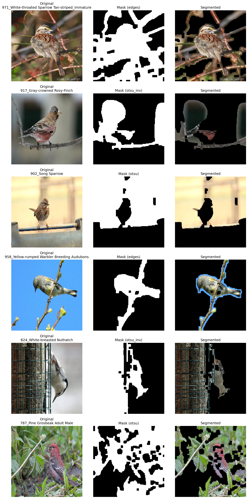

# Introdução

Este projeto investiga o problema de **identificação de espécies de pássaros** por meio de uma **pipeline de Visão Computacional Clássica**, sem uso de modelos de Deep Learning. A proposta foi construída como uma prova de conceito a partir do dataset **Backyard Feeder Birds (NABirds Subset)**, com o objetivo de explorar técnicas tradicionais de processamento de imagens, segmentação, extração de características e classificação supervisionada.

A escolha do tema busca atender ao espírito da disciplina, que enfatiza a implementação prática de métodos de análise de imagens para resolver um problema real de visão computacional. Entre os objetivos específicos da disciplina está justamente proporcionar experiência prática com esses métodos por meio de trabalhos de implementação e da resolução de problemas concretos de mundo real.

## Contexto do problema

A classificação de espécies de pássaros é um problema interessante porque combina dois aspectos importantes para a área:

1. **Variabilidade intra-classe e inter-classe**: diferentes imagens da mesma espécie podem variar bastante em pose, iluminação, escala e fundo, enquanto espécies diferentes podem apresentar aparência muito semelhante.
2. **Necessidade de etapas intermediárias de processamento**: ao contrário de problemas simples em que a imagem inteira já contém informação suficientemente limpa, aqui há fundos complexos, galhos, comedouros, sombras e outros elementos que dificultam a análise direta.

Essas características tornam o problema adequado para uma abordagem clássica, na qual se constrói explicitamente uma pipeline de processamento composta por várias etapas especializadas. Esse tipo de organização é coerente com a visão apresentada no material da disciplina: em Visão Computacional clássica não existe um algoritmo genérico que “enxerga”; o que existe é um conjunto de algoritmos específicos, encadeados em uma pipeline, cuja escolha depende tanto da tarefa quanto das características das imagens analisadas.

## Motivação para a abordagem clássica

Embora problemas de classificação visual hoje sejam frequentemente tratados com redes neurais profundas, este projeto opta deliberadamente por uma solução baseada em **métodos clássicos**. Essa escolha tem três motivações principais.

A primeira é **didática**. O objetivo aqui não é apenas obter a melhor acurácia possível, mas compreender como diferentes transformações sobre a imagem afetam o resultado final da classificação.

A segunda é **metodológica**. A disciplina trabalha fortemente com a ideia de pipeline: transformações de imagem para imagem, seguidas de segmentação, rotulação, extração de parâmetros e, por fim, classificação. Esse encadeamento aparece de forma recorrente no material de referência do professor e na organização conceitual onde a análise de imagens progride por etapas de abstração sucessivas.

A terceira é **experimental**. Em um problema como o de espécies de pássaros, uma abordagem clássica permite avaliar explicitamente o papel de cada componente: pré-processamento, segmentação, extração de cor, textura, forma e bordas, além do impacto do classificador utilizado.

## Fundamentação conceitual

O projeto se apoia principalmente em conceitos da Visão Computacional Clássica discutidos ao longo da disciplina:

- **Domínio do valor**, com operações como limiarização e histogramas;
- **Domínio do espaço**, com uso de bordas, morfologia matemática, segmentação e componentes conexas;
- **Extração de características**, transformando regiões de imagem em vetores de atributos utilizáveis por métodos de Reconhecimento de Padrões;
- A extender **Classificação supervisionada**, usando algoritmos clássicos de aprendizado de máquina.

No material da disciplina, a segmentação é apresentada como etapa central para simplificar a imagem, produzindo uma “caricatura” da realidade em que as partes relevantes são preservadas e os detalhes desnecessários são reduzidos. No caso deste projeto, essa ideia é especialmente importante: antes de classificar a espécie, é desejável isolar o máximo possível a região do pássaro, reduzindo a influência do fundo.

Além disso, o material do professor destaca que, após a segmentação, torna-se necessário descrever os objetos presentes na imagem por meio de parâmetros e rótulos, para então realizar a classificação e a tomada de decisão automatizada. Essa visão está diretamente refletida neste trabalho, que transforma a imagem original em um vetor de características composto por informações de cor, textura, forma e bordas.

## Objetivo do projeto

O objetivo geral deste trabalho é desenvolver uma **prova de conceito de identificação e classificação de espécies de pássaros** com base em uma pipeline clássica de Visão Computacional.

De forma mais específica, o projeto busca:

- organizar um fluxo completo de processamento de imagens;
- comparar estratégias clássicas de segmentação para isolar o pássaro do fundo;
- extrair descritores visuais relevantes a partir da região segmentada;
- avaliar um classificador supervisionado usando esses descritores;
- documentar os limites e potencialidades da abordagem clássica nesse tipo de problema.

## Estratégia adotada

A solução implementada no notebook segue, em linhas gerais, a seguinte sequência:

1. **Carregamento e exploração do dataset**  
   Identificação das classes e inspeção visual das imagens.

2. **Pré-processamento**  
   Redimensionamento, conversão de espaço de cor e suavização da imagem.

3. **Segmentação clássica**  
   Aplicação de múltiplas estratégias, como Otsu, threshold adaptativo e etc, seguida de operações morfológicas e seleção da melhor máscara candidata.

### Exemplo visual de segmentação

A figura a seguir ilustra um caso em que a estratégia baseada em bordas consegue separar bem o pássaro do fundo. Esse tipo de resultado reduz a influência de regiões irrelevantes na etapa de extração de características.

*Figura: comparação entre imagem original, máscara binária e imagem segmentada.*

#### Valores usados para gerar os resultados de segmentação

Os resultados mostrados nesta documentação foram gerados com os seguintes parâmetros (conforme `notebooks/main.ipynb`). Esses dados são temporários e podem ser ajustados para explorar diferentes resultados, foram decididos com fins de teste empiricamente e não representam uma configuração otimizada.

- **Pré-processamento**
   - redimensionamento para `IMG_SIZE = (160, 160)`;
   - conversão para tons de cinza;
   - suavização com `GaussianBlur(gray, (5, 5), 0)`.

- **Limpeza da máscara (pós-processamento comum a todos os métodos)**
   - abertura morfológica com kernel `3 x 3`;
   - fechamento morfológico com kernel `5 x 5`;
   - retenção apenas da maior componente conexa (`connectivity=8`).

- **Candidatos de segmentação testados**
   - `otsu`: `THRESH_BINARY + THRESH_OTSU`;
   - `otsu_inv`: `THRESH_BINARY_INV + THRESH_OTSU`;
   - `adaptive`: `ADAPTIVE_THRESH_GAUSSIAN_C`, `THRESH_BINARY`, `blockSize=21`, `C=4`;
   - `edges`: `Canny(60, 140)` + dilatação (`kernel 3 x 3`, `iterations=2`) + fechamento (`kernel 5 x 5`);
   - `hsv_sat`: `inRange(HSV, (0, 25, 20), (179, 255, 255))`;
   - `grabcut`: retângulo inicial com margens de `10%` em cada borda (`x=0.10w`, `y=0.10h`, `w=0.80w`, `h=0.80h`) e `5` iterações.

- **Critério de escolha da melhor máscara**
   - cálculo de `area_ratio = area_mascara / area_imagem`;
   - bônus de score se `0.03 <= area_ratio <= 0.65`;
   - penalização fora desse intervalo;
   - acréscimo da fração da maior componente conexa na área total da máscara.

1. **Extração de características**  
   Cálculo de atributos clássicos sobre a região segmentada:
   - histogramas de cor;
   - textura;
   - medidas geométricas e momentos de forma;
   - descritores derivados de bordas e gradientes.

2. **Classificação**  
   Uso de um classificador supervisionado clássico para prever a espécie do pássaro a partir do vetor de características.

Esse encadeamento é coerente com a própria lógica de exemplos completos de pipeline apresentados no material da disciplina, nos quais se parte da imagem, constrói-se uma representação mais abstrata por meio de descritores e, então, aplica-se um método de reconhecimento de padrões para chegar à classificação final.

## Escopo desta prova de conceito

Por se tratar de uma POC, o foco do projeto não está em construir um sistema final otimizado, mas em validar a viabilidade da abordagem e analisar seus resultados. Assim, algumas simplificações foram adotadas, como a restrição a um subconjunto de classes mais frequentes do dataset e o uso de um conjunto selecionado de descritores visuais.

Ainda assim, a estrutura proposta é suficientemente completa para demonstrar uma pipeline clássica coerente, reprodutível e alinhada aos conteúdos da disciplina.

## Organização da documentação

A documentação deste projeto está organizada para acompanhar a evolução da pipeline implementada no notebook principal. Em geral, o material cobre:

- visão geral do problema;
- descrição do dataset utilizado;
- metodologia de segmentação e extração de características;
- configuração experimental;
- resultados obtidos;
- discussão das limitações e possíveis extensões.

Com isso, o projeto busca não apenas apresentar um resultado computacional, mas também registrar de forma clara o raciocínio metodológico por trás da solução desenvolvida.