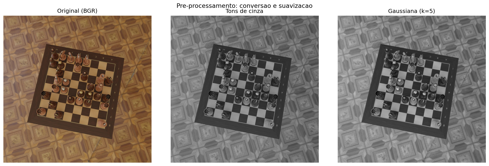
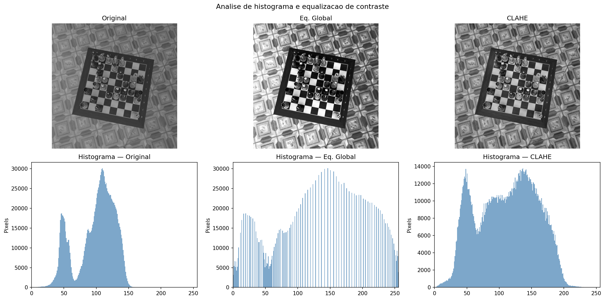
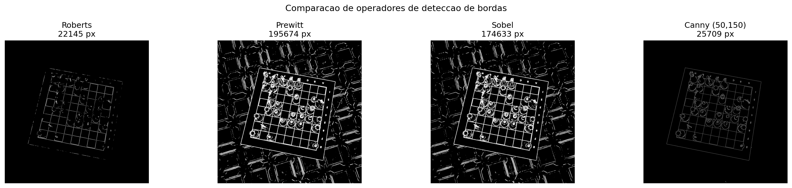
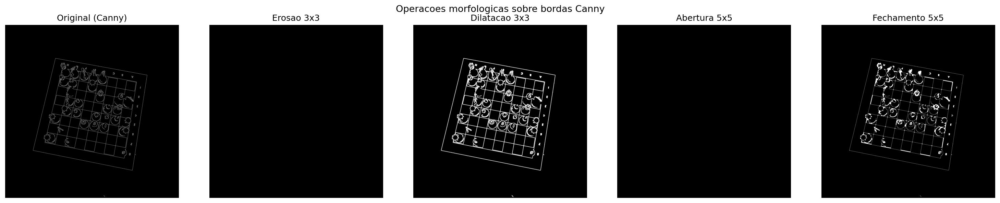
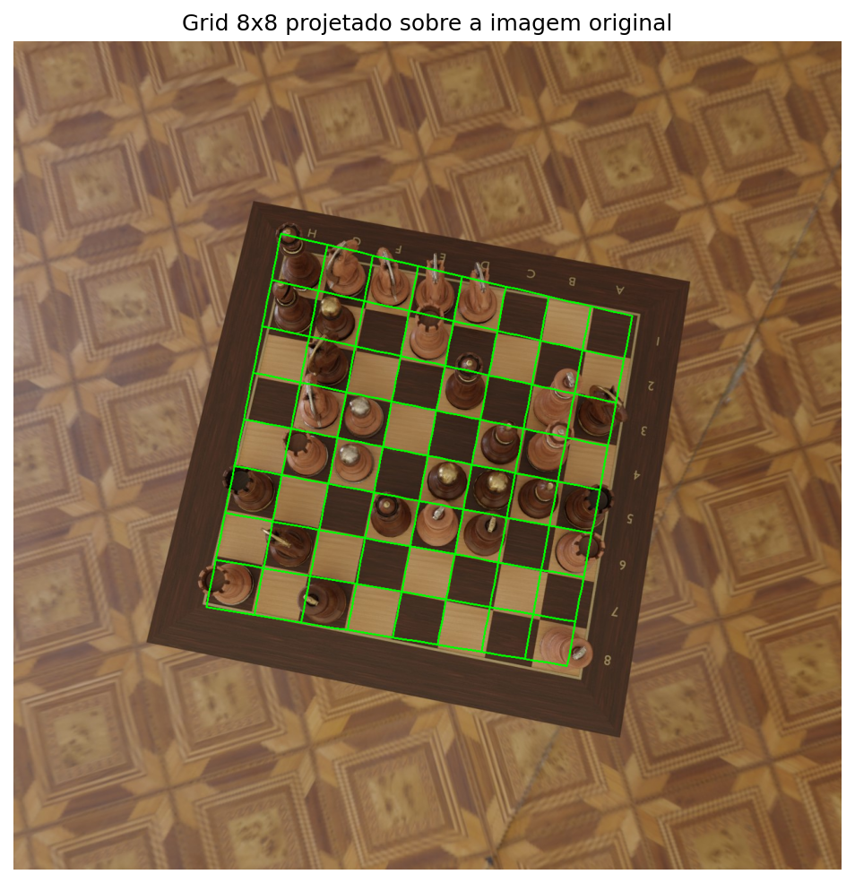
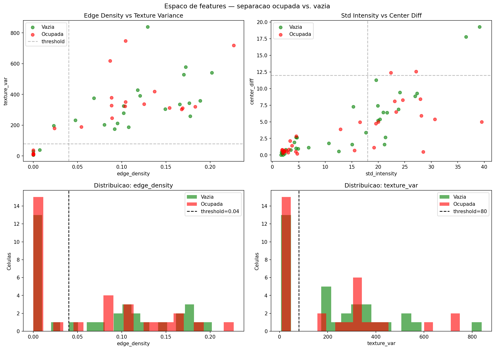
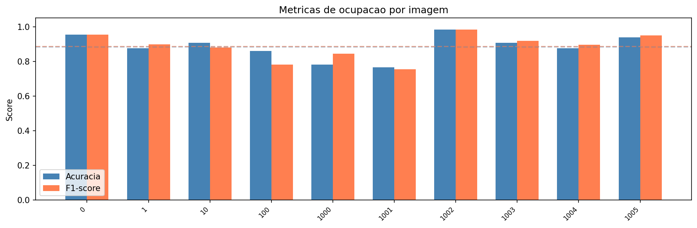

# Analise de Tabuleiros de Xadrez

## Visao computacional classica para leitura de tabuleiros, identificacao e classificacao de pecas

Este projeto implementa uma **pipeline de Visao Computacional Classica** para leitura de tabuleiro de xadrez — da imagem bruta ate a deteccao de ocupacao e cor das pecas, sem uso de Deep Learning. Utiliza o dataset **Synthetic Chess Board Images** (Kaggle, thefamousrat).

## Contexto do problema

A digitalizacao automatica de partidas de xadrez tem aplicacoes reais:

- **Transmissao de torneios**: converter partidas fisicas em notacao digital (PGN) em tempo real;
- **Assistentes de analise**: alimentar engines com a posicao detectada por camera;
- **Acessibilidade**: descricao automatica de partidas para deficientes visuais;
- **Ensino de CV**: o tabuleiro combina geometria regular com variabilidade visual.

O problema e interessante para CV classica porque combina:

1. **Geometria projetiva**: o tabuleiro sofre distorcao de perspectiva que exige correcao via homografia;
2. **Analise de features visuais**: diferenciar casas ocupadas de vazias requer descritores classicos (intensidade, bordas, textura);
3. **Analise de cor**: distinguir pecas claras de escuras usando o espaco HSV.

## Motivacao para a abordagem classica

Embora problemas de deteccao visual hoje sejam tratados com redes neurais, este projeto opta por **metodos classicos** por tres razoes:

**Didatica**: compreender como cada transformacao (suavizacao, deteccao de bordas, Hough, homografia) afeta o resultado, e como se encadeiam em uma pipeline coerente.

**Metodologica**: a disciplina trabalha com pipeline progressiva — transformacoes de imagem para imagem, seguidas de extracao de parametros e analise.

**Experimental**: a abordagem classica permite avaliar o papel de cada componente isoladamente, facilitando o entendimento das limitacoes.

## Fundamentacao conceitual

O projeto se apoia nos conceitos da disciplina:

- **Dominio do valor**: histogramas de intensidade, equalizacao (global e CLAHE), limiarizacao;
- **Dominio do espaco**: operadores de borda (Roberts, Prewitt, Sobel, Canny), suavizacao gaussiana, operacoes morfologicas (erosao, dilatacao, abertura, fechamento);
- **Geometria projetiva**: Transformada de Hough para linhas, homografia para correcao de perspectiva;
- **Extracao de features**: descritores de intensidade, textura (Laplaciano), densidade de bordas;
- **Analise de cor**: espaco HSV para classificacao de cor de pecas;
- **Analise temporal**: comparacao de estados entre frames para deteccao de jogadas.

## Pipeline implementada

A solucao segue sete etapas:

### 1. Pre-processamento

Conversao para tons de cinza e suavizacao gaussiana para reduzir ruido.

### 2. Analise de histograma

Equalizacao global e CLAHE para melhorar contraste.

### 3. Deteccao de bordas

Comparacao de operadores (Roberts, Prewitt, Sobel, Canny) e aplicacao de operacoes morfologicas.

### 4. Deteccao de linhas e grid

Transformada de Hough para encontrar as linhas do grid e projecao sobre a imagem original.

### 5. Correcao de perspectiva e segmentacao

Homografia para visao top-down e divisao em 8x8 celulas.

### 6. Deteccao de ocupacao e cor

Features classicas (intensidade, bordas, textura, contraste) com classificador por votacao. Classificacao de cor via HSV.

### 7. Deteccao de jogadas

Comparacao temporal de mapas de ocupacao entre dois frames.

## Dataset

**Synthetic Chess Board Images** (Kaggle, thefamousrat)

| Propriedade | Valor |
| --- | --- |
| Resolucao | 1280 x 1280 pixels (JPEG) |
| Perspectiva | Vista angular (nao top-down) |
| Material | Madeira (pecas e tabuleiro) |
| Anotacoes | JSON com posicoes de pecas e cantos |
| Licenca | CC0 — Dominio Publico |

## Estado atual e proximos passos

O objetivo final e construir um sistema completo de leitura de tabuleiro de xadrez:

| Etapa | Descricao | Status |
| --- | --- | --- |
| **1. Leitura do tabuleiro** | Detectar, corrigir perspectiva, segmentar 8x8 | Concluido |
| **2. Identificacao de ocupacao** | Determinar quais casas tem pecas | Concluido |
| **3. Classificacao de pecas** | Identificar tipo de peca (peao, torre, bispo...) | Concluido — F1 = 91% |
| **4. Indicacao de jogadas** | Comparar estados, gerar notacao PGN | Planejado |

### Proximo objetivo: Classificacao de pecas

Abordagens classicas a investigar:

- **Template matching** (NCC/SSD) com templates de referencia
- **Hu Moments** para descritores de forma invariantes
- **Contornos + area/perimetro** para diferenciar silhuetas
- **HOG** (Histogram of Oriented Gradients) para textura direcional

### Visao futura: Indicacao de jogadas

Com a classificacao resolvida, o sistema podera reconstruir a posicao completa (FEN), gerar notacao algebrica (ex: Nf3, exd5) e validar legalidade dos lances.

### Limitacoes conhecidas

- Material uniforme (madeira sobre madeira) = baixo contraste peca-fundo
- Projecao 3D das pecas "vaza" para celulas vizinhas
- Simetria de 180 do tabuleiro impede deteccao completa de orientacao
- Limiares calibrados para o dataset

## Organizacao da documentacao

- **intro.md**: este documento — visao geral do projeto
- **apresentacao.md**: slides Marp para apresentacao em aula
- **notebooks/main.ipynb**: notebook principal com implementacao e explicacoes
- **src/chess.py**: modulo com todas as funcoes de CV
